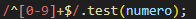

# Indice
[funcionalidades](#funcionalidades)

[funcoes](#funções)

[tecnologias_utilizadas](#tecnologias-utilizadas)

[gif_demonstrativo](#gif-demonstrativo)

[autor](#autor)

## Funcionalidades

    Esse código é um teste de API, uma API (Application Programming Interface) é uma interface de programação de aplicativos usada no desenvolvimento web e de software. Permite que diferentes aplicativos interajam por meio de solicitações e compartilhem dados de forma segura e eficiente.

## Funções
 
## Modo Restrito ('use strict')

    Objetivo: Ativa o modo restrito no JavaScript, impondo regras mais rígidas para a escrita do código e ajudando a evitar erros comuns.
    Benefícios:
    Evita a criação de variáveis globais por acidente.
    Impede o uso de palavras-chave reservadas como nomes de variáveis.
    Garante um comportamento mais consistente do código.

2. ## Limpando o Formulário

#### Função limparFormulario:

    Limpa os campos do formulário antes de uma nova consulta, garantindo que os dados anteriores sejam removidos.
    Acessa cada elemento do formulário pelo seu ID e atribui um valor vazio.

3. ## Validando o CEP

#### Função eNumero: 

    Verifica se uma string contém apenas números. Utiliza uma expressão regular para testar se todos os caracteres da string são dígitos.

#### Função cepValido:

    Verifica se um CEP é válido.
    Verifica se o CEP possui exatamente 8 caracteres.
    Chama a função eNumero para garantir que todos os caracteres são números.

4. ## Preenchendo o Formulário:

#### Função preencherFormulario:

    Preenche os campos do formulário com os dados retornados pela API.
    Atribui os valores das propriedades do objeto endereco aos respectivos campos do formulário.

5. ## Consumindo a API ViaCEP

### Função pesquisarCep:

    Realiza a consulta à API ViaCEP e preenche o formulário com os dados obtidos.
    
### limparFormulario:

    Chama a função limparFormulario.

### Monta a URL da consulta: 

    Concatena a URL base da API com o CEP informado.

### Realiza a requisição:
 
    Utiliza o método fetch para fazer uma requisição à API.
    Converte a resposta para formato JSON.

#### Verifica se houve erro: 

    Se a propriedade erro estiver presente no objeto de resposta, exibe um alerta informando que o CEP não foi encontrado.
    Preenche o formulário: Caso contrário, chama a função preencherFormulario para preencher os campos com os dados do endereço.

6. ## Event Listener

    Ativa a função pesquisarCep quando o usuário sair do campo de CEP.
    Adiciona um event listener ao elemento com o ID 'cep' para o evento 'focusout'. Quando o evento ocorre, a função pesquisarCep é executada.

#### Async/Await: 

    As palavras-chave async e await são utilizadas para lidar com operações assíncronas de forma mais intuitiva, como a requisição à API.

#### Fetch API:

    A API Fetch é utilizada para fazer requisições HTTP de forma mais moderna e concisa.

#### JSON:

    O formato JSON é utilizado para trocar dados entre o servidor e o cliente.

#### Expressões Regulares: 

    A expressão regular ^[0-9]+$ é usada para verificar se uma string contém apenas dígitos.
    

## Tecnologias utilizadas:
 
 
* [<code></code>](https://developer.mozilla.org/pt-BR/docs/Web/HTML)
* [<code></code>](https://github.com/)
* [<code></code>](https://git-scm.com/)
* [<code></code>](https://code.visualstudio.com/)
* [<code></code>](https://fontawesome.com/versions)
 
## gif demonstrativo:

## Autor:
|  [ Luan Alencar](https://github.com/luan18alencar) |  
| :---: |

